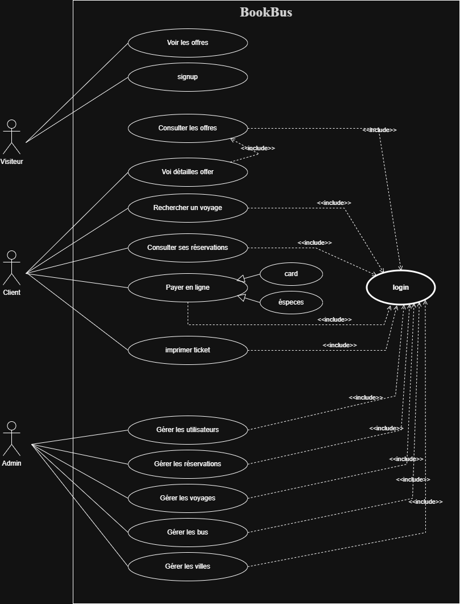
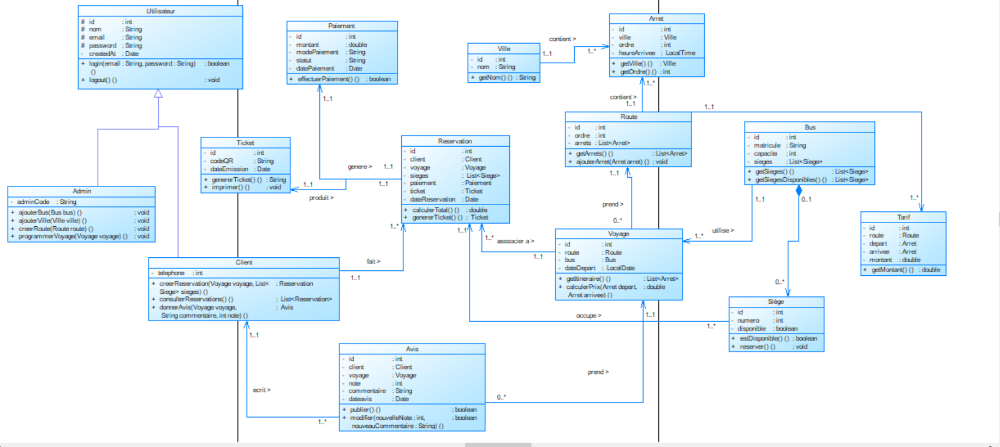

# BookBus - Plateforme de Réservation de Bus

## Description

BookBus est une plateforme web de réservation de billets de bus inter-villes au Maroc, inspirée de marKoub.ma. Elle permet aux voyageurs de rechercher et réserver des billets en ligne facilement.

## Objectif

Simplifier la réservation de billets de bus pour les voyageurs marocains et faciliter la gestion des voyages pour les compagnies de transport.

## Utilisateurs

- **Clients** : Voyageurs qui recherchent et réservent des billets
- **Administrateurs** : Compagnies de bus qui gèrent leurs voyages et réservations

## Fonctionnalités

### Pour les Clients

- Rechercher des trajets par ville et date
- Comparer les prix des différentes compagnies
- Réserver et payer en ligne
- Consulter l'historique des réservations
- Annuler une réservation

### Pour les Administrateurs

- Gérer les compagnies de bus
- Gérer les bus (immatriculation, modèle, capacité)
- Créer et gérer les trajets
- Programmer les voyages avec horaires et tarifs
- Consulter les statistiques et rapports

## Technologies

- **Backend** : Laravel 10+ (PHP 8.2+)
- **Base de données** : MySQL
- **Frontend** : Blade, Tailwind CSS
- **Authentification** : Laravel Breeze

## Base de Données

8 tables principales :

- `users` - Utilisateurs
- `bus_companies` - Compagnies de bus
- `buses` - Véhicules
- `routes` - Trajets entre villes
- `trips` - Voyages programmés
- `bookings` - Réservations
- `payments` - Paiements
- `seats` - Sièges réservés

## Compagnies Incluses

- CTM
- Supratours
- SATAS
- Pullman du Sud
- Ghazala
- Trans Ghazala
- Nejme Chamal
- Stareo

## Exemples de Tarifs

| Trajet                 | Distance | Tarif  |
| ---------------------- | -------- | ------ |
| Casablanca → Rabat     | 87 km    | 45 DH  |
| Casablanca → Marrakech | 241 km   | 75 DH  |
| Casablanca → Fès       | 298 km   | 95 DH  |
| Casablanca → Tanger    | 338 km   | 110 DH |
| Casablanca → Agadir    | 508 km   | 140 DH |

## Contexte

Projet développé dans le cadre de la formation **Développeur Web full stack** .

**Objectifs pédagogiques :**

- Analyse d'un domaine métier
- Conception de base de données
- Modélisation UML
- Installation et configuration Laravel
- Gestion de projet avec Git/GitHub

---

**Version :** 1.0  
**Date :** Janvier 2026  
**Statut :** MVP (Minimum Viable Product)

## B. Proposition d'architecture

### Diagramme de cas d'utilisation

### Schéma de base de données (MCD/ERD)

